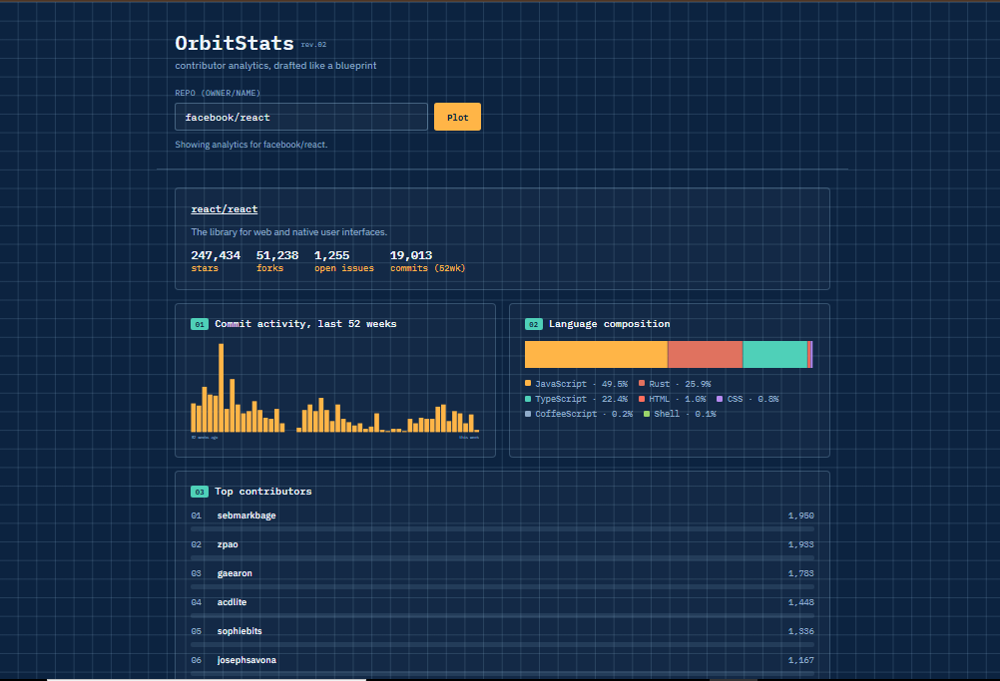

# OrbitStats — Contributor Analytics Dashboard

A blueprint-style analytics dashboard for any public GitHub repository: weekly commit activity over the last year, language composition, and a ranked contributor leaderboard — all rendered as SVG charts with zero charting library.

**[Live demo →](https://arjayb.github.io/OrbitStats/)**



## Features

- Commit-frequency bar chart, 52 weeks, built from GitHub's contributor stats endpoint
- Language composition bar with percentage breakdown
- Top-8 contributor leaderboard with proportional bars
- Handles GitHub's async stats computation (`202` responses) with polling and a friendly wait message
- Handles the real edge cases of a public API: unknown repos (404), rate limiting (403), and network failures, each with a clear message
- Zero dependencies — vanilla HTML, CSS, and JavaScript

## Why no backend?

The [GitHub REST API](https://docs.github.com/en/rest) serves public repository and contributor-statistics data over plain HTTPS with CORS enabled, so the browser can call it directly — no server needed to proxy requests or hide a key, because none is required for this kind of read-only public data.

**Rate limit:** unauthenticated requests are capped at 60 per hour, per IP address, by GitHub.

**Note on stats computation:** very large or very old repositories can take a moment for GitHub to compute contributor stats on first request — the app polls and shows a wait message rather than failing outright. The contributor leaderboard is capped at the top 8 for legibility.

## Run it locally

Clone the repo and open `index.html` in a browser. No build step, no `npm install`.

```bash
git clone https://github.com/arjayb/OrbitStats.git
cd OrbitStats
open index.html   # or just double-click it
```

If your browser blocks `fetch` on the `file://` protocol, serve it with any static server instead:

```bash
python3 -m http.server 8000
# then visit http://localhost:8000
```

## Deploy to GitHub Pages

1. Push this repo to GitHub.
2. Go to **Settings → Pages**.
3. Under **Build and deployment**, set **Source** to `Deploy from a branch`, pick `main` and `/ (root)`.
4. Save — your app will be live at `https://<your-username>.github.io/OrbitStats/` within a minute or two.

## Project structure

```
OrbitStats/
├── index.html    # markup
├── style.css     # blueprint theme, chart layout, leaderboard bars
├── script.js     # GitHub API calls, stats polling, SVG chart rendering
└── README.md
```

## Data source

All data comes from the public [GitHub REST API](https://docs.github.com/en/rest), including the repository, contributor-stats, and languages endpoints. No authentication, no API key, no user data is stored — every lookup is a fresh, live request.

## License

MIT — use this however you'd like.
